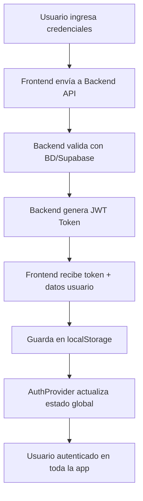

# DalePata Frontend

## 🐾 Descripción General

DalePata es una aplicación web de adopción y rescate de mascotas construida con **Next.js 14.2.16**. El frontend maneja la interfaz de usuario, autenticación con backend API, y la gestión de estados de usuario.

## 🏗️ Arquitectura del Proyecto

### Estructura de Carpetas

```
dalepata/
├── app/                          # App Router de Next.js 13+
│   ├── globals.css              # Estilos globales
│   ├── layout.js                # Layout raíz con AuthProvider
│   ├── page.jsx                 # Página principal (home)
│   ├── middleware.js            # Middleware simplificado (sin protección de rutas)
│   │
│   ├── auth/                    # Páginas de autenticación
│   │   ├── login/page.js        # Página de inicio de sesión
│   │   ├── registro/page.js     # Página de registro
│   │   └── confirmacion/page.js # Confirmación de registro
│   │
│   ├── adoptar/                 # Sección de adopción
│   │   ├── page.jsx             # Lista de mascotas en adopción
│   │   └── [id]/page.jsx        # Perfil individual de mascota
│   │
│   ├── perdidos/                # Mascotas perdidas/encontradas
│   │   ├── page.jsx             # Lista de mascotas perdidas
│   │   └── reportar/page.jsx    # Reportar mascota perdida
│   │
│   ├── turnos/                  # Gestión de turnos veterinarios
│   │   ├── page.jsx             # Lista de turnos
│   │   └── nuevo/page.jsx       # Crear nuevo turno
│   │
│   ├── favoritos/page.js        # Mascotas favoritas del usuario
│   ├── historial/page.js        # Historial de actividades
│   ├── perfil/                  # Perfil de usuario
│   │   ├── page.js              # Página principal del perfil
│   │   └── test.js              # Página de testing del perfil
│   │
│   └── debug/page.js            # Herramienta de debug para autenticación
│
├── components/                   # Componentes reutilizables
│   ├── ui/                      # Componentes de UI base (shadcn/ui)
│   │   ├── button.jsx
│   │   ├── card.jsx
│   │   ├── input.jsx
│   │   └── ... (más componentes)
│   │
│   ├── backend-auth-provider.js # Proveedor de autenticación principal
│   ├── protected-route.jsx      # Componente para rutas protegidas
│   ├── header.js                # Header con navegación y dropdown de usuario
│   ├── header-debug.js          # Versión de debug del header
│   ├── sidebar.js               # Barra lateral de navegación
│   │
│   └── ... (componentes específicos de mascotas)
│
├── lib/                         # Utilidades y configuración
│   ├── api.js                   # Servicio principal de API
│   ├── api-config.js            # Configuración de endpoints y debug
│   ├── utils.js                 # Utilidades generales
│   └── supabase/                # Configuración de Supabase (legacy)
│
├── hooks/                       # Custom React Hooks
│   ├── use-mobile.js
│   └── use-toast.js
│
└── public/                      # Archivos estáticos
    └── ... (imágenes de mascotas)
```

## 🔐 Sistema de Autenticación

### Arquitectura de Autenticación

El sistema de autenticación está **completamente migrado del frontend al backend**:

- **Frontend**: Maneja solo la interfaz y el estado del usuario
- **Backend API**: Maneja toda la lógica de autenticación, tokens JWT, y base de datos
- **Supabase**: Solo para gestión de usuarios en el backend (NO en frontend)

### Flujo de Autenticación



### Componentes Clave de Auth

#### 1. **AuthProvider** (`components/backend-auth-provider.js`)

El corazón del sistema de autenticación:

```javascript
// Funcionalidades principales:
- Inicialización automática de sesión desde localStorage
- Gestión del estado global del usuario
- Verificación de tokens en segundo plano
- Métodos signIn/signOut
- Context para toda la aplicación
```

**Características importantes:**
- **Persistencia**: Guarda token y usuario en localStorage
- **Recuperación automática**: Al refrescar página, recupera la sesión
- **Validación inteligente**: Verifica tokens sin bloquear la UI
- **Limpieza automática**: Elimina tokens inválidos

#### 2. **ApiService** (`lib/api.js`)

Servicio centralizado para todas las llamadas a la API:

```javascript
// Métodos principales:
- login(email, password, userType) // Autenticación
- register(userData)               // Registro de usuarios
- getUserProfile()                 // Obtener perfil del usuario
- fetchPets()                      // Obtener lista de mascotas
- fetchPetById(id)                 // Obtener mascota específica

// Gestión de tokens:
- getToken() / setToken()          // Manejo de localStorage
- getUser() / setUser()            // Manejo de datos de usuario
- logout()                         // Limpieza completa
```

#### 3. **Configuración API** (`lib/api-config.js`)

Centraliza endpoints y configuración:

```javascript
export const API_CONFIG = {
  BASE_URL: 'http://localhost:3001/api', // Backend API
  DEBUG: true // Logs detallados
}

export const API_ENDPOINTS = {
  LOGIN: '/auth/login',
  REGISTER_USER: '/auth/register/usuario',
  PROFILE: '/auth/profile',
  LIST_PETS: '/pets',
  GET_PET: (id) => `/pets/${id}`
}
```

### Middleware y Protección de Rutas

#### Middleware Simplificado

```javascript
// middleware.js - NO protege rutas a nivel de servidor
// La protección se maneja en el frontend por componente

export async function middleware(request) {
  return NextResponse.next() // Permite acceso a todas las rutas
}
```

#### Protección de Rutas en Frontend

**Opción 1: Componente ProtectedRoute**
```jsx
<ProtectedRoute>
  <ComponenteProtegido />
</ProtectedRoute>
```

**Opción 2: Lógica integrada en el componente**
```jsx
const { user, loading } = useAuth()

if (loading) return <Loading />
if (!user) return <LoginPrompt />
return <ContenidoProtegido />
```

## 📱 Páginas y Funcionalidades

### Páginas Públicas
- `/` - Página principal con lista de mascotas
- `/auth/login` - Inicio de sesión
- `/auth/registro` - Registro de usuarios
- `/adoptar` - Lista de mascotas en adopción
- `/adoptar/[id]` - Perfil de mascota específica

### Páginas Protegidas
- `/perfil` - Perfil del usuario
- `/favoritos` - Mascotas favoritas
- `/historial` - Historial de actividades
- `/turnos` - Gestión de turnos veterinarios
- `/perdidos/reportar` - Reportar mascota perdida

### Páginas de Desarrollo
- `/debug` - Herramienta de debug para autenticación
- `/perfil/test` - Testing del perfil de usuario

## 🎨 Sistema de UI

### Componentes Base (shadcn/ui)

La aplicación usa **shadcn/ui** como sistema de componentes base:

```
components/ui/
├── button.jsx          # Botones con variantes
├── card.jsx            # Tarjetas de contenido
├── input.jsx           # Campos de entrada
├── dropdown-menu.jsx   # Menús desplegables
├── avatar.jsx          # Avatares de usuario
├── badge.jsx           # Etiquetas y badges
└── ... (más componentes)
```

### Estilos y Theming

- **CSS Framework**: Tailwind CSS
- **Tokens de diseño**: Variables CSS custom
- **Tema**: Sistema de colores consistente
- **Responsive**: Mobile-first design

## 🔌 Integración con Backend

### Endpoints Principales

```javascript
// Autenticación
POST /api/auth/login                    // Iniciar sesión
POST /api/auth/register/usuario         // Registro de usuario
GET  /api/auth/profile                  // Obtener perfil

// Mascotas
GET  /api/pets                          // Lista de mascotas
GET  /api/pets/:id                      // Mascota específica
```

### Manejo de Errores

```javascript
// Tipos de errores manejados:
- 400: Errores de validación
- 401: No autorizado (token inválido)
- 403: Prohibido
- 404: No encontrado
- 500: Error del servidor

// Estrategia de manejo:
- Logs detallados en desarrollo
- Mensajes user-friendly
- Redirección automática en errores de auth
- Retry automático en errores de red
```

### Estados de Carga

```javascript
// Estados globales manejados:
- loading: Cargando inicial de autenticación
- user: Datos del usuario autenticado
- error: Errores de autenticación o API

// Estados locales por componente:
- Formularios: submitting, validation errors
- Listas: fetching, empty states
- Detalles: loading individual items
```

## 🚀 Flujo de Desarrollo

### Comandos Principales

```bash
# Desarrollo
npm run dev          # Servidor de desarrollo (puerto 3000)

# Construcción
npm run build        # Build para producción
npm run start        # Servidor de producción

# Linting
npm run lint         # Verificar código
```

### Debugging

#### Herramienta de Debug (`/debug`)

Página especial para diagnosticar problemas de autenticación:

- **Estado de localStorage**: Tokens y datos guardados
- **Estado del AuthProvider**: Usuario en context
- **Información de red**: Estado de conexión con backend
- **Botones de testing**: Limpiar auth, ir a perfil, etc.

#### Logs de Desarrollo

```javascript
// En development, logs detallados:
console.log('🔄 Initializing auth...')
console.log('✅ Login successful')
console.log('❌ Auth error:', error)
console.log('📤 API Request:', data)
console.log('📥 API Response:', response)
```

## 🔧 Configuración del Entorno

### Variables de Entorno

```env
# .env.local (no incluir en git)
NEXT_PUBLIC_API_BASE_URL=http://localhost:3001/api
NEXT_PUBLIC_SUPABASE_URL=tu_supabase_url
NEXT_PUBLIC_SUPABASE_ANON_KEY=tu_supabase_key
```

### Puertos por Defecto

- **Frontend**: `http://localhost:3000`
- **Backend API**: `http://localhost:3001`
- **Base de datos**: Configurada en el backend

## 🚨 Troubleshooting

### Problemas Comunes

#### 1. "No puedo acceder a páginas protegidas"
```bash
# Solución:
1. Ir a /debug
2. Verificar si hay token y usuario guardados
3. Si no hay datos, hacer login nuevamente
4. Si hay datos pero no funciona, verificar backend
```

#### 2. "Error de CORS"
```bash
# El backend debe permitir requests desde:
- http://localhost:3000 (desarrollo)
- Tu dominio de producción
```

#### 3. "Token expirado"
```bash
# El sistema maneja automáticamente:
- Limpia tokens inválidos
- Redirige al login
- Mantiene UX fluida
```

#### 4. "Redirecciones infinitas"
```bash
# Verificar middleware.js:
- No debe tener protección de rutas activa
- Solo debe hacer NextResponse.next()
```

### Logs de Debug

Para activar logs detallados:

```javascript
// En api-config.js
export const API_CONFIG = {
  DEBUG: true // Activar logs detallados
}
```

## 📋 Checklist de Funcionalidades

### ✅ Completado
- [x] Sistema de autenticación con backend
- [x] Registro y login de usuarios
- [x] Persistencia de sesión en localStorage
- [x] Protección de rutas
- [x] Lista de mascotas desde API
- [x] Perfil de usuario
- [x] Dropdown de usuario funcional
- [x] Páginas de adopción
- [x] Sistema de debugging

### 🔄 En Desarrollo
- [ ] Edición de perfil de usuario
- [ ] Sistema de favoritos funcional
- [ ] Gestión de turnos veterinarios
- [ ] Reportar mascotas perdidas
- [ ] Notificaciones

### 📈 Mejoras Futuras
- [ ] PWA (Progressive Web App)
- [ ] Notificaciones push
- [ ] Chat en tiempo real
- [ ] Geolocalización
- [ ] Búsqueda avanzada con filtros

## 🤝 Colaboración

### Para Nuevos Desarrolladores

1. **Clonar y setup inicial**:
```bash
git clone [repo-url]
cd dalepata
npm install
npm run dev
```

2. **Entender el flujo de auth**:
   - Revisar `backend-auth-provider.js`
   - Probar `/debug` para entender el estado
   - Experimentar con login/logout

3. **Estructura de archivos**:
   - `app/` para páginas (App Router)
   - `components/` para reutilizables
   - `lib/` para lógica y API

4. **Debugging**:
   - Usar `/debug` para problemas de auth
   - Activar logs en `api-config.js`
   - DevTools de React para estados

### Convenciones de Código

- **Componentes**: PascalCase (`UserProfile.jsx`)
- **Hooks**: camelCase con prefix `use` (`useAuth`)
- **Archivos**: kebab-case (`user-settings.js`)
- **Constantes**: UPPER_CASE (`API_ENDPOINTS`)

---

## 📞 Contacto y Soporte

Para dudas sobre la implementación o problemas técnicos, consultar:

1. **Logs de debug** en `/debug`
2. **Console del navegador** para errores
3. **Terminal del servidor** para errores de build
4. **Este README** para arquitectura general

---

**¡Feliz coding! 🐾✨**